# Active-Directory-Ticketing-Lab
Setup a virtual network with a pfsense gateway, DC01, and a windows workstation to practice managing user accounts, setting up GPOs and an ubuntu machine that manages a ticketing system.

## Topology 

## Overview
 - Deployed an Active Directory environment within vmware on a virtual network with an Ubuntu osTicket system and a Windows 11 workstation under the domain name buisness.local.

 - Simulated a helpdesk ticket where user John would be locked out of his account on AD. John navigated to the local ticketing system domain and submitted a ticket. In which the admin responded to the ticket and reset the password on AD. Afterwards the AD admin verified that John was able to log in. 

 - Setup Microsoft 365 business with user provisioning, shared mailboxes, distribution groups, and Conditional Access policies enforcing MFA across targeted applications with role-based permissions. 

- Machine verification

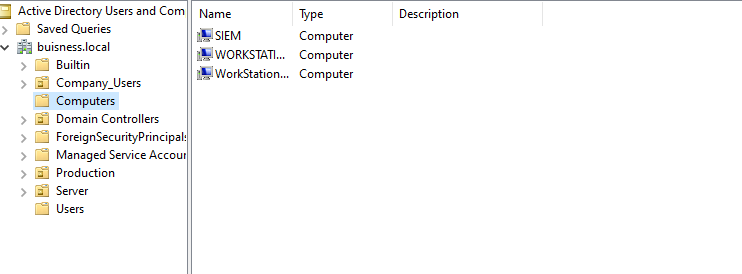

 ## Scenario 1
 - John gets locked out of his AD account and submits a ticket on the local ticketing system. 

 1.) John gets locked out

 

 2.) John submits a ticket

 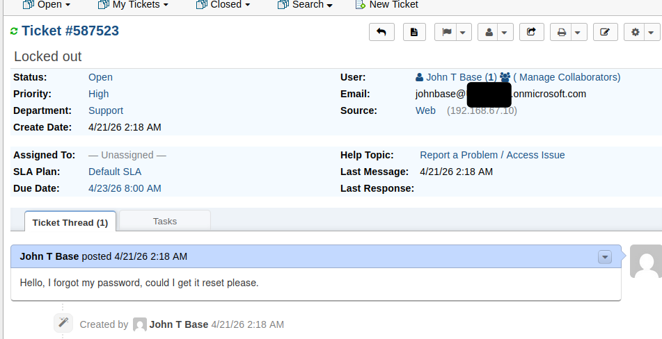

 3.) Help Desk notices a new ticket

  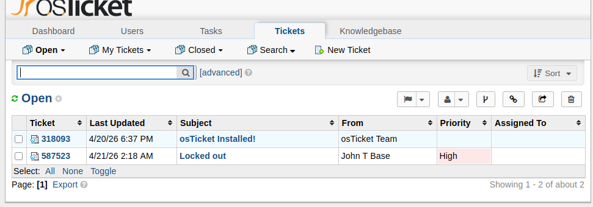

 4.) Help Desk responds to the new ticket

 

 5.) AD admin resets Johns password

 

 6.) Help Desk communicates with John in person or over the phone the temporary password. 

 

 7.) Verifies John's login via powershell logs or eventviewer

 

 8.) Ticket Closed

 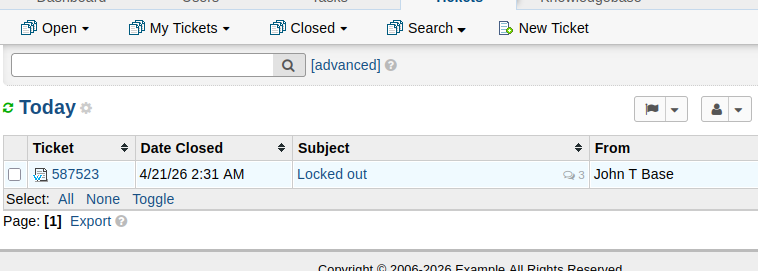

 ## Scenario 2
 - Setup an environment on microsoft entra and user john forgot his password and needs it reset. 

 1.) Password Reset
 

 2.) Password Reset on John's end

 

## Additional Actions Taken

- Created a security group giving the siem_admin admin access 

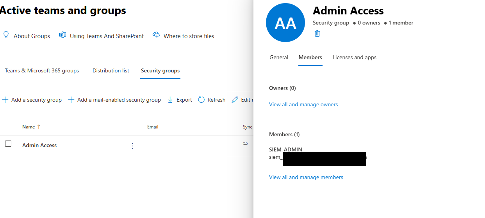

- Browsed login audit logs

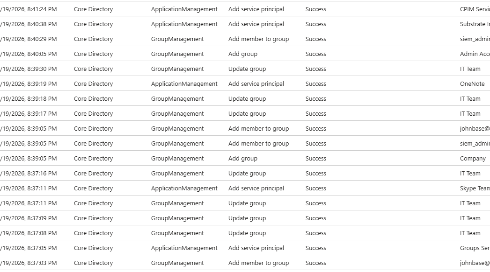

- Browsed audit log in logs

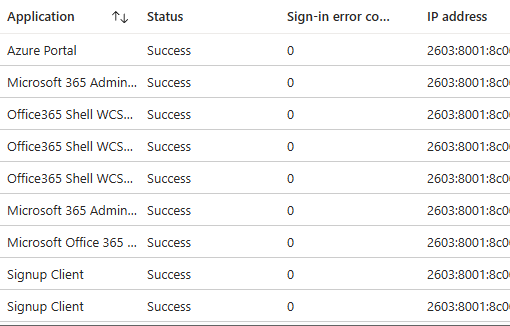

- MFA enforcement Policy

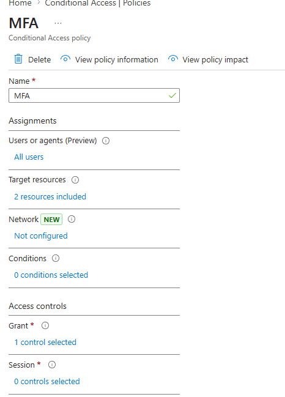

- MFA verification

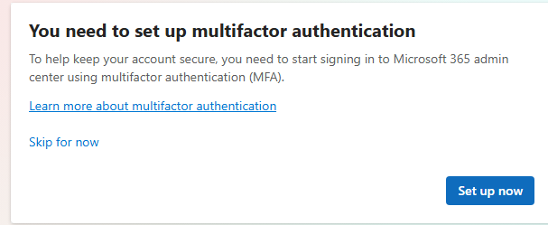

- ITS group creation

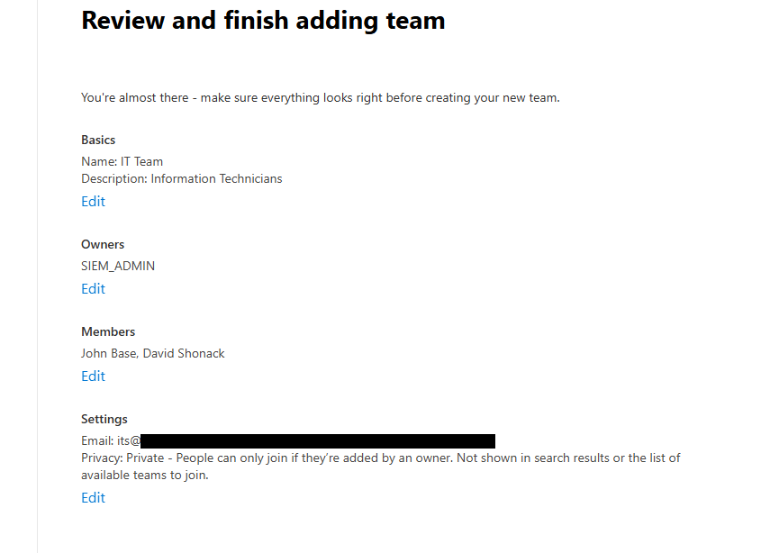

- Shared Mailbox Creation

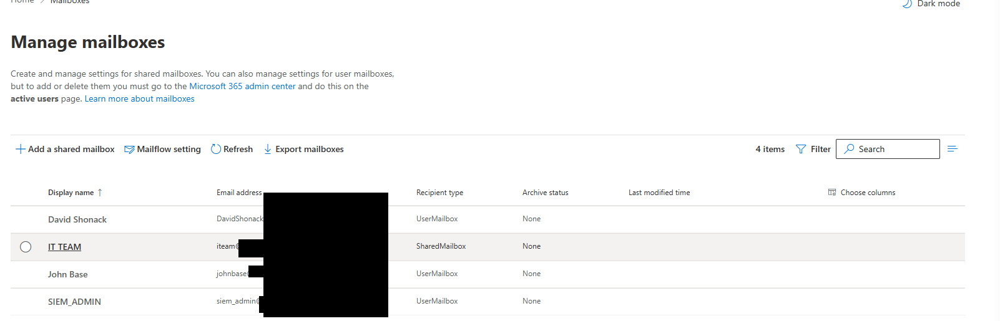